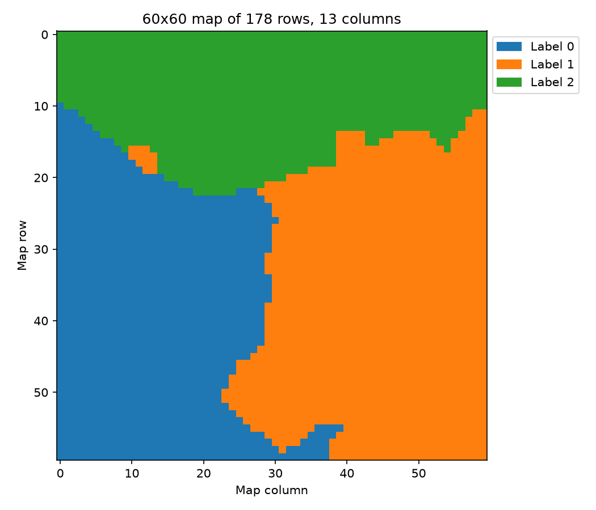
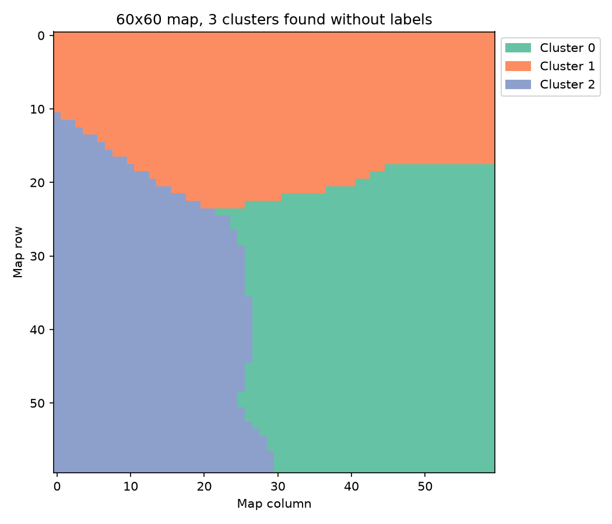

# Kohonen Self-Organising Map: code review and refactor

This repository is my response to the Mantel Machine Learning Engineering challenge: a review of
Sam's Self-Organising Map (SOM), with the improvements implemented. The original is untouched in
[`kohonen_example/`](kohonen_example/). Install with `pip install -r requirements.txt`, then run
`python main.py` to produce every output in `outputs/`.

**A note on AI.** I used AI as a coding assistant, the way I would in my day-to-day work, rather
than vibe-coding the project. The direction and the decisions were mine. I worked to understand
the SOM in depth, how it would be used on a real problem, and how to keep the code clean and
maintainable to the standard I apply in my current role. I checked each change by comparing its
outputs before and after, and I can walk through any part of the code.

**I deliberately took the project further than the brief.** Asking whether a function is well
written is only part of the question. The other part is whether it helps solve the problem it
exists for. So beyond refactoring Sam's code, the project also:

- **Shows the map learning:** snapshots of the map during training, so you can see how it
  organises itself and when it settles.
- **Clusters the trained map without labels, and describes each cluster.** This is the classic
  next step after training a SOM. It turns a picture into groups you can use and explain.
- **Applies it to a real dataset** (UCI wine), not just random colours.

My recommendations reflect that. When I give advice, I'm thinking about how the code will be used,
evaluated and maintained, not only about how it reads.

---

## 1. Observations

These are the observations I collected when first reading the code, without any assistance from AI:

| # | Observation | How it's addressed |
|---|---|---|
| 1 | Greek letters and non-descriptive names | Descriptive names: `radius`, `learning_rate`, `time_constant`, `influence`, `find_bmu` |
| 2 | `α0` hard-coded to 0.1 | `learning_rate` is a constructor argument, set per map in the config |
| 3 | Four nested loops, no vectorisation | Vectorised over all nodes, with only two remaining for-loops |
| 4 | One large function | Training broken into the following functions: `find_bmu`, `_gaussian`, with numbered, commented stages in `fit` |
| 5 | No comments | Added detailed comments and Docstrings to explain each key mathematical step |
| 6 | Should be a class | `SelfOrganisingMap` with `fit` / `predict` |
| 7 | A lot of logic under `if __name__ == "__main__":` | Now it only calls `main()` |
| 8 | A notebook, not a script | Classes and functions, with a runnable main.py script |
| 9 | No random seeds | `seed` in the config, passed to a local `np.random.default_rng` (no global random state) |
| 10 | `exp(-t/λ)` calculated twice | One `decay` value shared by the radius and the learning rate |

---

## 2. Top 5 recommendations

1. **Vectorise the training loop, and simplify the maths.** This is the single biggest win:
   about 140x faster with identical results. The algorithm itself is unchanged; the work is
   organised differently. [Details](#31-could-the-code-be-made-more-efficient).

2. **Restructure into a reusable, configurable class with `fit` / `predict`.** This means
   descriptive names, settings in a config file, seeded randomness, and separate classes for the
   model, clustering and plots. Other developers can then use the map on new data and
   change settings without editing code.

3. **Measure the map, don't just draw it.** A picture can't tell you whether a map is any good, so
   this project turns it into numbers, saved as CSVs: how many natural groups the map contains,
   chosen by silhouette score, and what defines each one. What it doesn't yet measure is whether
   the map generalises. The next step would be a built-in train/test split or cross-validation,
   comparing how well the map fits the training data and the test data. If it fits the test data
   noticeably worse, it's overfitting.

4. **Test it on real data, not just random colours.** Random colours have no true answer to
   check against, and they hide real-world problems: exactly 3 features, all on the same 0–1
   scale. A real dataset (UCI wine) surfaces the issues that matter in practice, such as feature
   scaling and grid sizing. Because its groups are known, it also shows whether the map found
   genuine structure: here it recovered the three cultivars with 94% agreement, without seeing the
   labels.

5. **Pair the map with a way to use it, typically clustering.** On its own, a SOM produces a
   picture: a grid of prototypes, not a set of groups. To create value, it usually needs a next
   step, most often clustering the map's nodes into segments (here, k-means with the number of
   groups chosen by silhouette score, and each cluster described by its most distinctive
   features). More broadly, decide up front how the map will be used
   (segments, features for another model, outlier flags) rather than delivering the method in
   isolation and leaving the next developer to work that out.

---

## 3. The challenge questions

### 3.1 Could the code be made more efficient?

Yes. On the brief's two examples:

| Example | Original | Refactor | Speed-up |
|---|---:|---:|---:|
| 10x10 map, 100 iterations | 0.35 s | 0.02 s | about 17x |
| 100x100 map, 1000 iterations | 336.5 s | 2.4 s | **about 140x** |

What changed, in [`self_organising_map.py`](src/kohonen_som/modelling/self_organising_map.py):

- **Vectorised over nodes.** Each update works on the whole grid at once with NumPy instead of
  looping over rows and columns in Python. The loop over samples has to stay, because each update
  changes the weights the next sample sees. That's inherent to the online SOM algorithm.
- **A separable Gaussian.** A node's influence is `exp(-d² / 2σ²)`. By Pythagoras, `d²` is the
  row gap² plus the column gap², and `exp(a + b) = exp(a) · exp(b)`. So the influence grid is the
  **outer product** of a row profile and a column profile. That's `height + width` exponentials
  instead of `height × width`: 200 instead of 10,000 on a 100x100 map, for every sample at every
  iteration.
- **One shared decay factor** per iteration for both the radius and the learning rate.
- **No square roots.** Finding the best matching unit (BMU) compares squared distances, which have
  the same minimum.
- **One subtraction reused.** `sample - weights` is used both to find the BMU and to update the
  weights.

### 3.2 Is the code best structured for later use by other developers and in anticipation of productionisation?

The original isn't. It's one function inside a notebook, with hard-coded assumptions and no way to
apply the result. The refactor is structured for reuse:

```
src/kohonen_som/                         The reusable SOM code (ready to become a package)
  modelling/
    self_organising_map.py               SelfOrganisingMap
    som_clustering.py                    SOMClustering
  visualisation/som_visualiser.py        SOMVisualiser

main.py                                  The application that uses it
config/config.yaml
app/config.py, app/paths.py, app/data_preprocessing.py, app/colour_plots.py
```

- **Reusable code, separate from the application.** The three classes in `src/kohonen_som/`
  don't depend on anything project-specific. `main.py`, the config, the paths and the demo data
  are the application that uses them, so the SOM code never decides where files go and can be
  reused in any project. The clustering returns tables rather than writing CSV files, so each
  project decides what to save, print or plot.
- **Clear boundaries.** Each class has one job, and dependencies only point one way:
  `visualisation` uses `modelling`, never the reverse. `SelfOrganisingMap` only needs itself.
- **A familiar interface.** `fit(data)` and `predict(data)` behave like scikit-learn. `predict`
  returns each row's grid position, so the map can be applied to new data.
- **Configuration instead of code edits.** Every setting is in
  [`config.yaml`](config/config.yaml), and every path in
  [`paths.py`](app/paths.py). Paths are built from the project root, so the code runs from
  any directory.
- **Reproducible.** A single seed controls every random step.
- **Readable.** Descriptive names, docstrings, and comments that explain *why* (for example,
  why the Gaussian can be split).

### 3.3 How would you approach productionising this application?

1. **Tests first.**
   - A regression test that checks the refactor gives the same results as Sam's original.
   - Unit tests for BMU search, the decay schedule and `predict`.
   - Tests for invalid input: grids with a longer side under 3, NaN values, feature counts that
     don't match the trained map.
2. **Validate inputs.**
   - Check inputs with clear error messages, rather than letting bad input train a broken map.
   - Add type hints throughout, so the wrong kind of input is caught during a CI/CD deployment and guides users in how to properly use the classes / functions.
3. **Package it.** The reusable code in `src/kohonen_som/` is already separate from the
   application, so it only needs a `pyproject.toml` to become an installable package. Any future
   application (a notebook, a pipeline or a service) could then install it and call `fit` /
   `predict`, with dependency versions pinned.
4. **Automate it with CI/CD.** On every change, a CI pipeline runs the tests and type checks. When
   a new version is released, the CD pipeline builds the package and publishes it to a private
   feed, for example Azure Artifacts, so any project can `pip install` the same tested version.

How it's then deployed, for example in a container, as a scheduled job or behind an API, depends
on how the map will be used. That isn't known yet, so I'd decide it once the use case is clear
rather than build it speculatively.

### 3.4 Anything else relevant

**The SOM finds real groups without labels.** On the wine dataset (178 wines, 13 chemical
measurements, 3 grape cultivars), the map only ever sees the measurements. The labels are used
afterwards, to check the result.

| Map coloured by the true cultivars | Clusters found without labels (k-means on the map's nodes) |
|---|---|
|  |  |

- **It outputs the optimal number of clusters.** The number of optimal clusters is 3, as chosen by the silhouette score.
- **It describes each cluster in plain English.** The table compares the clusters on every
  feature, ordered from strongest to weakest: each cluster's most distinctive feature first, then
  each cluster's second, and so on. Here are the 4 strongest features:

  | Cluster | Wines | Alcohol (%) | OD280/OD315 | Proline | Colour intensity | Summary | Mostly cultivar |
  |---|---:|---|---|---|---|---|---|
  | 0 | 60 | 12.22 (low) | 2.86 (average) | 504 (low) | 2.96 (low) | Lighter, paler, low proline | 1 (60 of 60) |
  | 1 | 56 | 13.06 (average) | 1.73 (low) | 625 (average) | 6.85 (high) | Deeply coloured, low OD280 | 2 (48 of 56) |
  | 2 | 62 | 13.70 (high) | 3.17 (high) | 1,092 (high) | 5.47 (average) | Strongest, high proline and OD280 | 0 (59 of 62) |
  | All | 178 | 13.00 | 2.61 | 747 | 5.06 | | |

  The full table, with all 13 features, is saved as `outputs/*_cluster_summary.csv`.

On real unlabelled data, such as customer segmentation, the same steps apply: train the map,
cluster its nodes, choose k by silhouette, then describe each cluster by its most distinctive
features. None of these steps needs labels.

Final thoughts: Variations of SOM exist. Batch SOM updates the map once per full dataset path and shuffling SOM, which uses a different random sample of the full dataset per iteration. Mini-batch SOM combines both of these ideas and can be ideal for very large datasets.